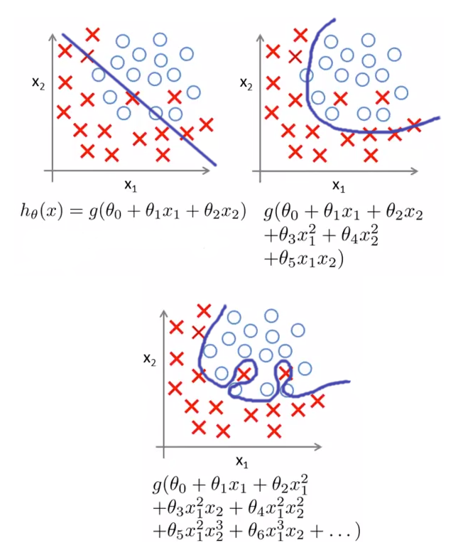

# Are those . . . more bias / variance conceptual questions??


### Before looking at the solution branch, check your answers against 
### someone else in the cohort


#### Fill in the following blanks for definitions of `bias` and `variance`

We have a situation where we have multiple samples and one algorithm.

For each sample, we train the algo on that sample, then make a prediction
for a single new observation the algo wasn't trained on

Let's define 'bias' and 'variance' in terms of the different predictions 
generated by the algo trained on different samples.

**Bias**: bias refers to the average _________

If we had a model with low bias, 
the average ________ would _________

If we had a model with high bias,
the average _________ would ________


**Variance**: variance refers to the average _________

If we had a model with low variance, 
the average ________ would _________

If we had a model with high variance,
the average ________ would _________


```python
'''
Your answers here

Bias:

Variance:  
'''
```


```python
#__SOLUTION__

'''
Bias: bias refers to the average difference between a prediction 
and its real value.

If we had a model with high bias,
the average predicted value would have a high difference with the  
average real value

If we had a model with low bias,
the average predicted value would have a low difference with the 
average real value

Variance: variance refers to the average difference between one 
model's prediction and the average prediction / "expected value" 
of all the predictions 

If we had a model with low variance,
the average difference between a model's prediction and the 
average prediction would be small

If we had a model with high variance,
the average difference between a model's prediction and the
average prediction would be high
'''
```

#### What is "overfitting"?  What is "underfitting"?

Bonus points for including discussion of "irreducible 
error" in how overfitting occurs


```python
'''
Your answers here
'''
```


```python
#__SOLUTION__

'''
Overfitting is when the model is trained too well on the training data. 
The parameters of the model fit too closely to the training data and don't
generalize well to data the model wasn't trained on.

BONUS POINTS: overfitting occurs when "irreducible error" is taken as
part of the underlying structure of the data-generating process, instead
of an exogenous component added to that process 

Underfitting is when the model doesn't adequately learn the underlying 
structure of the relationships among variables.  
'''
```

#### Discuss how underfitting relates to bias and/or variance

#### Discuss how overfitting relates to bias and/or variance


```python
'''
Your answers here
'''
```


```python
#__SOLUTION__

'''
When a model underfits, it is exhibiting high bias.  It is failing to 
adequately capture the underlying relationships of the data, meaning
that the average difference between a prediction and it's actual value
is high.  

When a model overfits, it is exhibiting high variance.  Because the model
is trained too well on the training data, it is unable to generalize well
to data the model wasn't trained on (aka test data).  As such, the 
average difference between any given prediction and the average prediction
will be high.  
'''

```

#### How do we diagnose overfitting and underfitting?


```python
'''
Your answers here
'''
```


```python
#__SOLUTION__

'''
We diagnose overfitting by looking at the difference
between training results and testing results.  The larger
the difference, the more overfitting is occuring.

We diagnose underfitting by looking at the training results.
The worse the training results, the more underfitting is
occuring.
'''
```

#### What are some techniques to mitigate over- and underfitting?


```python
'''
Your answers here
'''
```


```python
#__SOLUTION__

'''
In general, to mitigate underfitting, we make the model more complex
- add variables
- add interactions among variables
- raise variables to higher powers
- reduce the penalty to coefficient size (ie decrease regularization)

In general, to mitigate overfitting, we make the model less complex
- take out variables
- take out interactions among variables
- decrease the power variables are taken to
- increase the penalty to coefficient size (ie increase regularization)

'''
```

### Consider this graphic



Which is the most **complex** model?

Which is the most **underfit** model?

Which will have the **worst** training metrics?

Which will have the **largest difference** 
in training and testing metrics?


```python
'''
Your answers here
'''
```


```python
#__SOLUTION__

'''
Most complex is the last model.  It has the most terms and the
highest powers in those terms.  

The most underfit model is the first model.  It least captures
the underlying dynamics in the data, and it will have the 
highest average error in its training predictions.

The worst training metrics, as metioned above, will occur in the first
model.

The largest difference in training and testing metrics will
occur in the last model.  Because the last model is so fit
to the training data, it will have good training metrics. However, it will 
generalize poorly to the testing data, leading to a high difference
between training and testing metrics
'''
```
